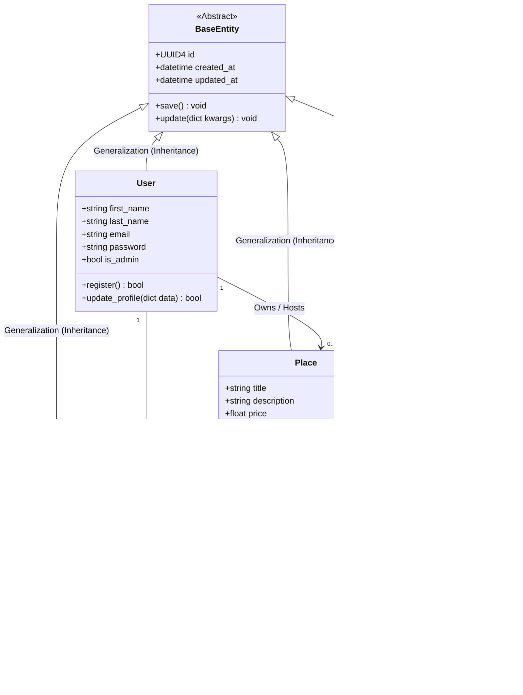

```mermaid
classDiagram
    class BaseEntity {
        <<Abstract>>
        +UUID4 id
        +datetime created_at
        +datetime updated_at
        +save() void
        +update(dict kwargs) void
    }

    class User {
        +string first_name
        +string last_name
        +string email
        +string password
        +bool is_admin
        +register() bool
        +update_profile(dict data) bool
    }

    class Place {
        +string title
        +string description
        +float price
        +float latitude
        +float longitude
        +UUID4 owner_id
        +create_place() bool
        +update_details(dict data) bool
        +add_amenity(UUID4 amenity_id) void
    }

    class Review {
        +string text
        +int rating
        +UUID4 place_id
        +UUID4 user_id
        +submit_review() bool
    }

    class Amenity {
        +string name
        +string description
        +create_amenity() bool
    }

    BaseEntity <|-- User : Generalization (Inheritance)
    BaseEntity <|-- Place : Generalization (Inheritance)
    BaseEntity <|-- Review : Generalization (Inheritance)
    BaseEntity <|-- Amenity : Generalization (Inheritance)

    User "1" --> "0..*" Place : Owns / Hosts
    User "1" --> "0..*" Review : Writes
    Place "1" *-- "0..*" Review : Contains (Composition)
    Place "0..*" --> "0..*" Amenity : Associated With (Aggregation)
```
