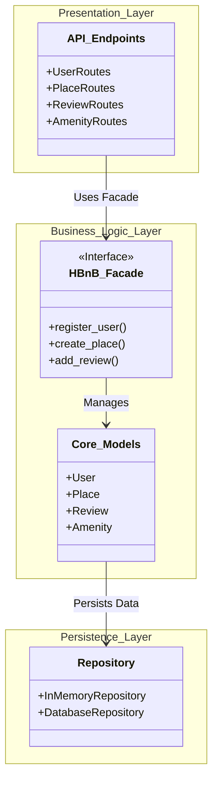
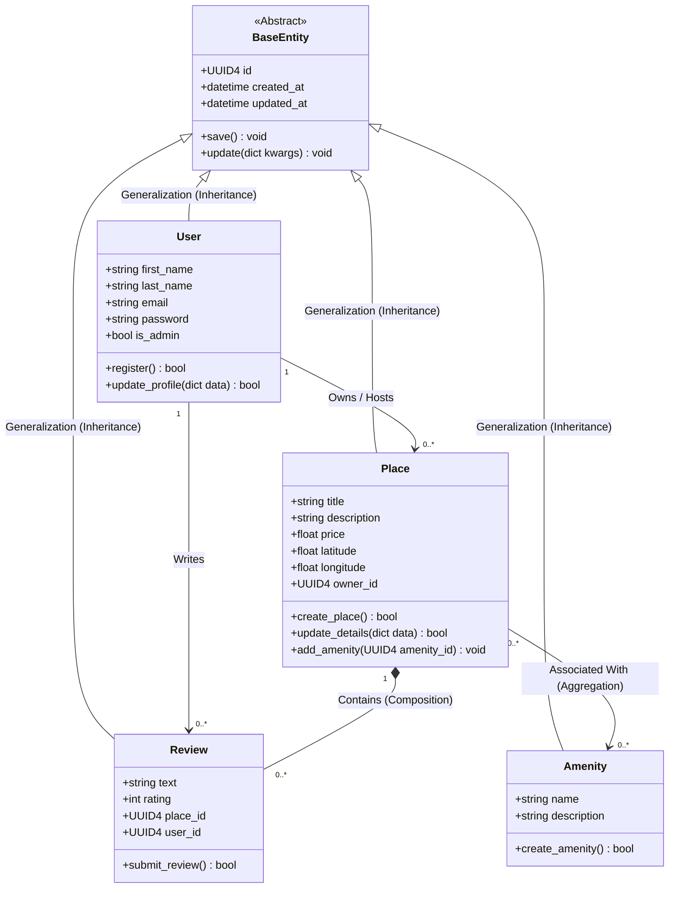
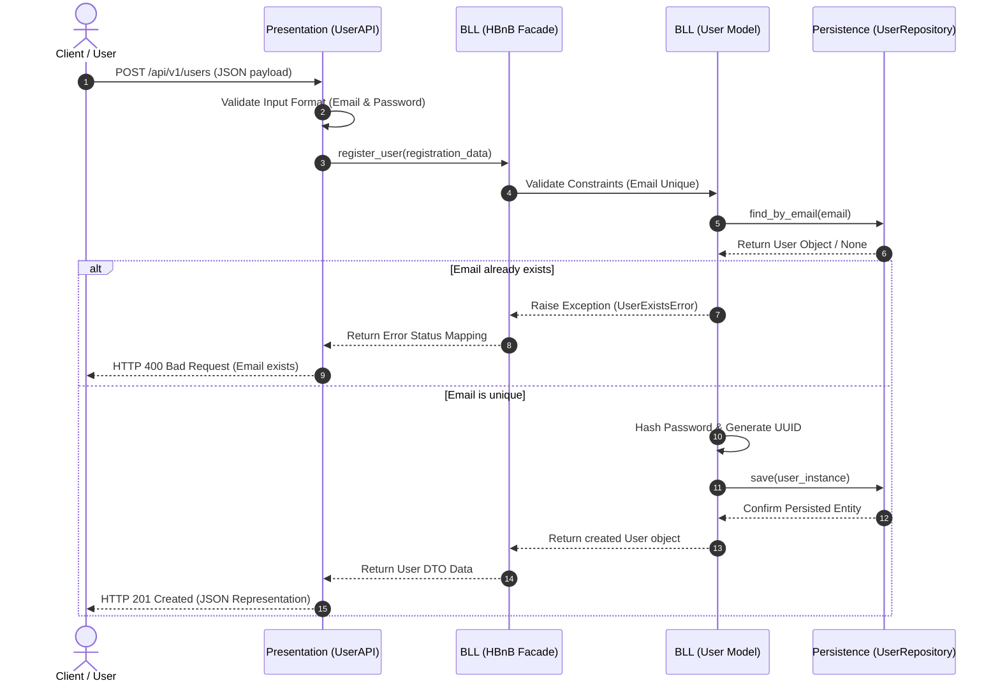
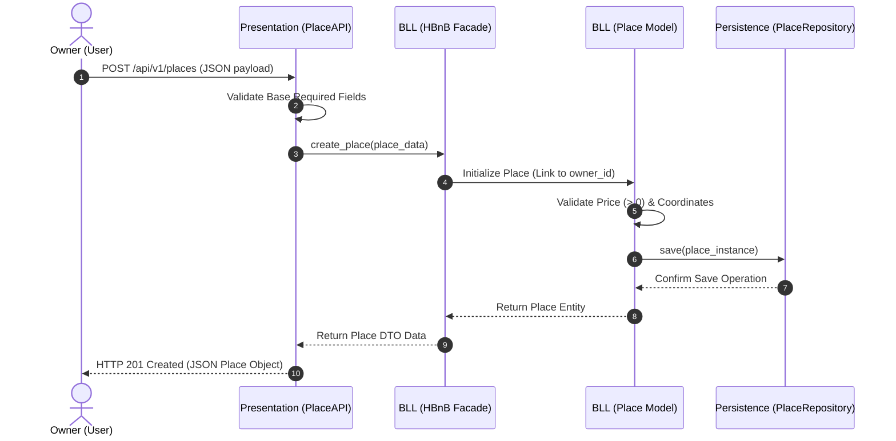
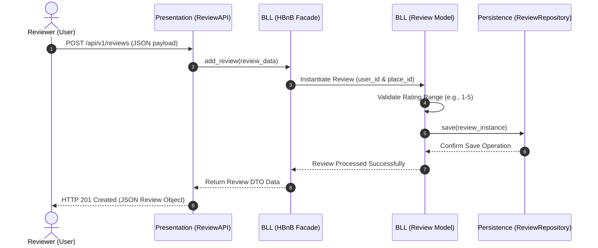
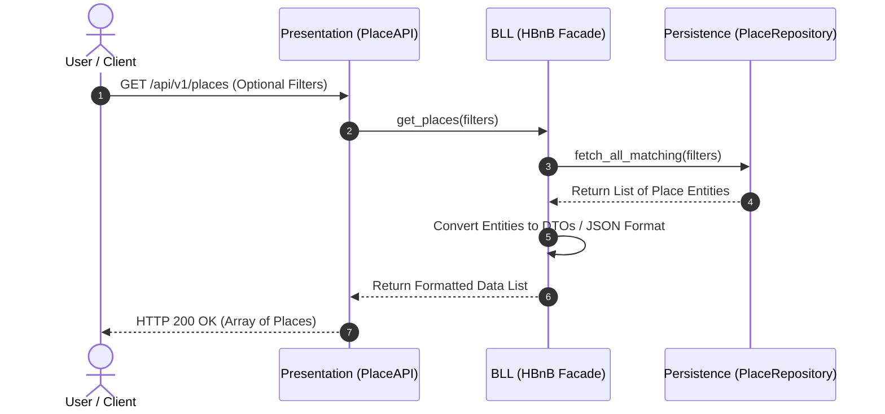

#
# HBnB Evolution - Part 1: Technical Documentation

This document presents the technical design of the HBnB Evolution application (Part 1). It provides the UML diagrams that describe the system architecture, the main business entities, and the interactions between application layers.

The documentation includes:

- High-Level Package Diagram
- Business Logic Class Diagram
- Sequence Diagrams

---

## Task 0: High-Level Package Diagram

This diagram presents the overall architecture of the application using a three-layer design. It also illustrates how the Presentation Layer communicates with the Business Logic Layer through the Facade pattern, while the Business Logic Layer interacts with the Persistence Layer for data storage.
. Package Diagram
### Description

Illustrates the 3-tier architecture (Presentation, Business Logic, Persistence) and uses the **Facade Pattern** to decouple layers.

* **Presentation Layer**: Handles API endpoints, user interface interactions.
* **Business Logic Layer**: Contains core operations and validation logic.
* **Persistence Layer**: Manages database interactions.
  
### Explanation:
- The **User**, **Place**, **Review**, and **Amenity** entities represent the main components of the system.
- The **Presentation Layer** (UI and API) interacts directly with the business models in the Business Logic Layer.
- Each business entity interacts with its corresponding repository in the Persistence Layer to store and retrieve data.

The system design employs the **Facade Pattern** between the Presentation Layer and Business Logic Layer to simplify interaction and isolate complexity. Below is the high-level architecture diagram:

---

---

## Task 1: Detailed Class Diagram for Business Logic Layer

The following class diagram represents the main business entities of the system. It includes their attributes, operations, inheritance relationships, and associations that define how the entities interact with one another.

This diagram represents the entities of this layer, their attributes, methods, and relationships. The main objective is to provide a clear and detailed visual representation of the core business logic, focusing on the key entities: 
- User
- Place
- Review
- Amenity
### Explanation:

Each core business entity is modeled with a base class that includes basic functionalities like creating, updating, and deleting entries:

- The **Entity** base class provides common functionalities such as create, update, and delete for all business entities.
- The **User** class manages user-related information and operations such as registering and updating user details.
- The **Place** class represents accommodation listings, storing details like price and location.
- the **Review** classe associated with a user place contains comments that user can give to a place.
- the **Amenity** classe associated to user's place contains all the commodities belongin to a user's place

The diagram details the attributes and methods, the relationships between classes (`1-to-N`, `N-to-N`), the timestamps (`created_at`, `updated_at`), and the unique identifiers (IDs).

---

## Task 2: Sequence Diagrams for API Calls

The following sequence diagrams describe how requests move through the Presentation, Business Logic, and Persistence layers for common application operations.

Sequence diagrams help visualize how different system components interact to address specific use cases, illustrating the step-by-step process of handling API requests. There will be four of them flow : 
- User Registration
- Place Creation
- Review Submission
- Place Listing
### 1. User Registration

This sequence shows the process of creating a new user account, including input validation, uniqueness verification, data persistence, and the response returned to the client.

### 2. Place Creation

This sequence illustrates how a new place is created, validated, stored, and returned to the client after successful processing.

### 3. Review Submission

This sequence demonstrates how a review is validated, saved, and returned after a successful submission.

### 4. Fetching a List of Places

This sequence describes how the application retrieves a filtered list of places and returns the formatted results to the client.

---
## Design Considerations

- Clear separation between layers
- Business Logic is isolated from direct database access
- API acts as the system entry point
- UML standards followed for clarity and consistency

---

### Conclusion

These diagrams provide a clear overview of:
- System **structure** (Class & Package diagrams)
- System **behavior** (Sequence diagrams)

They collectively explain how the HBnB application is designed and how data flows across its layers.
---
##     Resources

### UML Basics
- *OOP – Introduction to UML*

### Package Diagrams
- *UML Package Diagram Overview*  
- *UML Package Diagrams Guide*

### Class Diagrams
- *UML Class Diagram Tutorial*  
- *How to Draw UML Class Diagrams*

### Sequence Diagrams
- *UML Sequence Diagram Tutorial*  
- *Understanding Sequence Diagrams*

### Diagram Tools
- Mermaid.js  
- draw.io  

---
## Authors:
- Reem Alanazi
- Bayadir Aldossari
- Shomokh Aldossari

---
