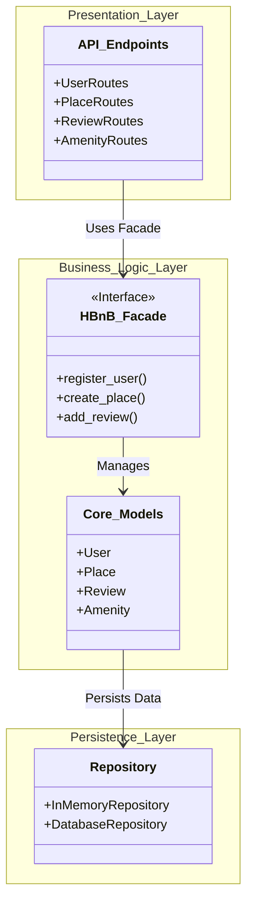
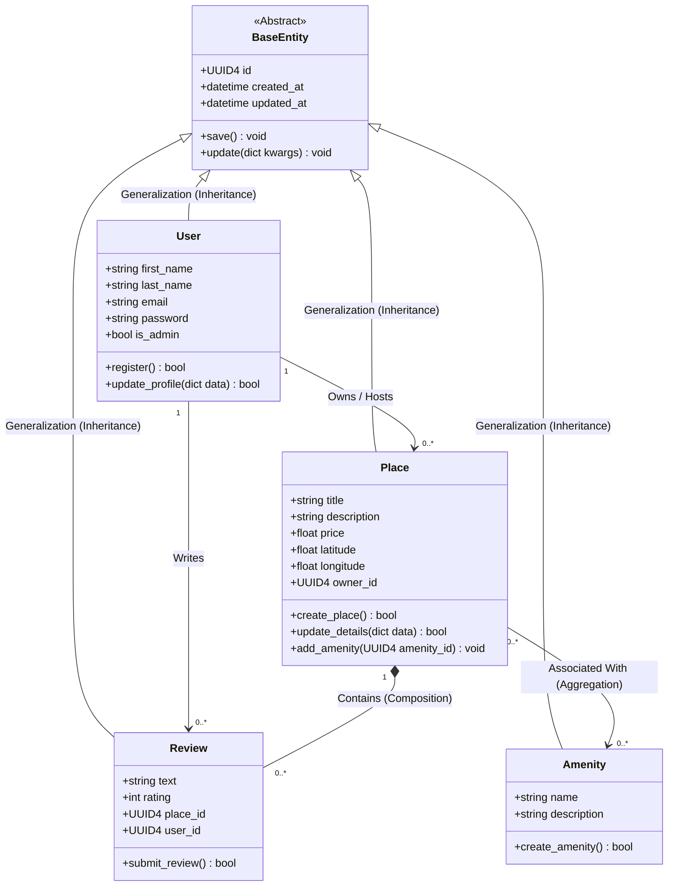

HBnB Evolution - Part 1: Technical Documentation

Task 0: High-Level Package Diagram

📊 Interactive High-Level Package Diagram

```mermaid
classDiagram
    namespace Presentation_Layer {
        class API_Endpoints {
            +UserRoutes
            +PlaceRoutes
            +ReviewRoutes
            +AmenityRoutes
        }
    }

    namespace Business_Logic_Layer {
        class HBnB_Facade {
            <<Interface>>
            +register_user()
            +create_place()
            +add_review()
        }
        class Core_Models {
            +User
            +Place
            +Review
            +Amenity
        }
    }

    namespace Persistence_Layer {
        class Repository {
            +InMemoryRepository
            +DatabaseRepository
        }
    }

    API_Endpoints --> HBnB_Facade : Uses Facade
    HBnB_Facade --> Core_Models : Manages
    Core_Models --> Repository : Persists Data

```
----
# 1. Detailed Class Diagram for Business Logic Layer

```mermaid
classDiagram
    %% Core System Components & Interfaces
    class BaseEntity {
        <<Abstract>>
        +UUID4 id
        +datetime created_at
        +datetime updated_at
        +save() void
        +update(dict kwargs) void
    }

    class User {
        +string first_name
        +string last_name
        +string email
        +string password
        +bool is_admin
        +register() bool
        +update_profile(dict data) bool
    }

    class Place {
        +string title
        +string description
        +float price
        +float latitude
        +float longitude
        +UUID4 owner_id
        +create_place() bool
        +update_details(dict data) bool
        +add_amenity(UUID4 amenity_id) void
    }

    class Review {
        +string text
        +int rating
        +UUID4 place_id
        +UUID4 user_id
        +submit_review() bool
    }

    class Amenity {
        +string name
        +string description
        +create_amenity() bool
    }

    %% Relationships and Design Patterns
    BaseEntity <|-- User : Generalization (Inheritance)
    BaseEntity <|-- Place : Generalization (Inheritance)
    BaseEntity <|-- Review : Generalization (Inheritance)
    BaseEntity <|-- Amenity : Generalization (Inheritance)

    User "1" --> "0..*" Place : Owns / Hosts
    User "1" --> "0..*" Review : Writes
    Place "1" *-- "0..*" Review : Contains (Composition)
    Place "0..*" --> "0..*" Amenity : Associated With (Aggregation)
```

