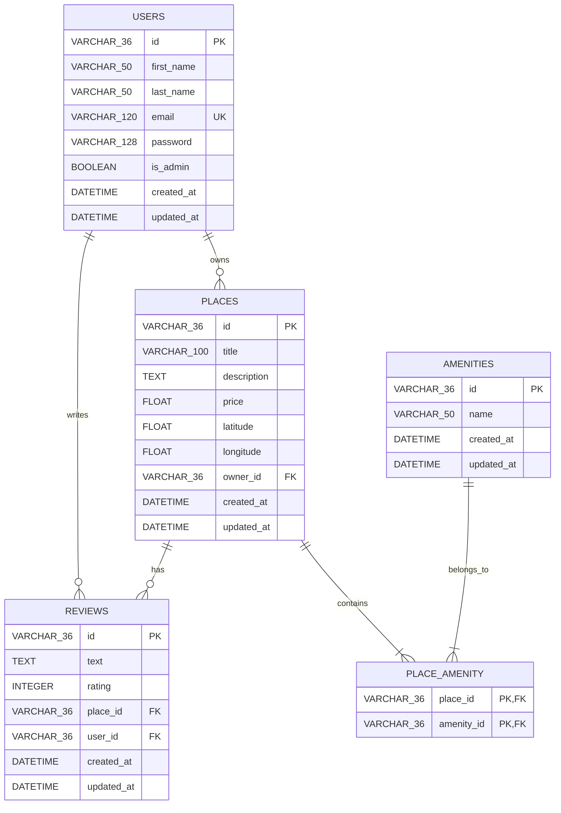

# HBnB Part 3 — Authentication and Database Persistence

## Description

Part 3 extends the HBnB backend with authentication, authorization, password hashing, and relational database persistence using **SQLAlchemy** and a **SQLite** database.

The application manages four core entities:
- **Users**
- **Places**
- **Reviews**
- **Amenities**

This version replaces the in-memory repository layer from Part 2 with SQLAlchemy ORM models, persistent database tables, relational foreign keys, JWT authentication, and SQL setup scripts.

---

## Technology Stack

- **Python 3**
- **Flask** & **Flask-RESTx**
- **Flask-SQLAlchemy** & **SQLAlchemy ORM**
- **Flask-Bcrypt** (Password Hashing)
- **Flask-JWT-Extended** (Authentication & Authorization)
- **SQLite3** (Database Engine)
- **Mermaid.js** (ER Diagramming)

---

## Project Structure

```text
part3/
├── app/
│   ├── api/
│   │   ├── __init__.py
│   │   └── v1/
│   │       ├── __init__.py
│   │       ├── amenities.py
│   │       ├── auth.py
│   │       ├── places.py
│   │       ├── reviews.py
│   │       └── users.py
│   ├── models/
│   │   ├── __init__.py
│   │   ├── amenity.py
│   │   ├── base.py
│   │   ├── place.py
│   │   ├── review.py
│   │   └── user.py
│   ├── persistence/
│   │   ├── __init__.py
│   │   └── repository.py
│   ├── services/
│   │   ├── __init__.py
│   │   └── facade.py
│   ├── __init__.py
│   └── extensions.py
├── er_diagram.md
├── hbnb_er_diagram.md
├── schema.sql
├── seed.sql
├── config.py
├── run.py
└── README.md
```
###Architecture & Data Flow
```text
Part 3 implements a layered architecture to decouple API routing, business logic, and database persistence:
API Layer (Flask-RESTx)
        │
        ▼
Facade Layer (Business Logic & Orchestration)
        │
        ▼
Repository Layer (SQLAlchemy ORM Data Access)
        │
        ▼
SQLite Database (development.db)
```

Database Schema & ER Diagram
The relational database architecture models connections between users, places, reviews, and amenities.


---

### API Layer

The API layer receives HTTP requests, validates input, checks
authentication and authorization, and returns JSON responses.

### Facade Layer

The facade coordinates operations between the API layer and the
repositories.

### Repository Layer

The repository layer handles database operations such as:

- Create
- Retrieve
- Update
- Delete
- Attribute lookup
- Relationship-specific queries

### Model Layer

SQLAlchemy models define the database entities and their relationships.

---

## Core Entities

### User

A user contains:

- ID
- First name
- Last name
- Email
- Hashed password
- Administrator status
- Creation timestamp
- Update timestamp

A user may own multiple places and write multiple reviews.

### Place

A place contains:

- ID
- Title
- Description
- Price
- Latitude
- Longitude
- Owner
- Amenities
- Reviews
- Creation timestamp
- Update timestamp

### Review

A review contains:

- ID
- Text
- Author
- Place
- Creation timestamp
- Update timestamp

A user may submit only one review for the same place.

### Amenity

An amenity contains:

- ID
- Name
- Creation timestamp
- Update timestamp

Places and amenities have a many-to-many relationship.

---

### 🗄️ Core Entities & Database Schema

The relational database architecture models connections between users, places, reviews, and amenities:

-User: ID, First name, Last name, Email, Hashed password, Administrator status (is_admin), Creation & Update timestamps. (A user may own multiple places and write multiple reviews).

-Place: ID, Title, Description, Price, Latitude, Longitude, Owner, Amenities, Reviews, Creation & Update timestamps.

-Review: ID, Text, Author, Place, Creation & Update timestamps. (A user may submit only one review for the same place).

-Amenity: ID, Name, Creation & Update timestamps. (Places and amenities have a many-to-many relationship).

---

